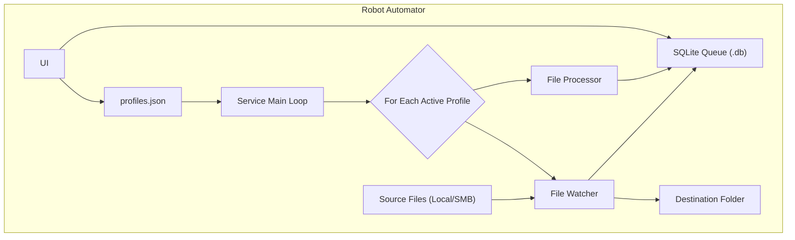

# Robot Automator

A robust, profile-based automation engine for APM Terminals, designed to monitor and process files from various sources based on configurable rules. This tool runs as a reliable Windows Service, ensuring continuous operation for critical data integration tasks.

## Overview

Robot Automator is a reliable, profile-driven automation engine for APM Terminals Pecém Terminal. It continuously monitors and processes files from multiple sources according to configurable rules, running seamlessly as a Windows Service to ensure uninterrupted operation of critical workflows.

## Data Flow & Architecture

The system is designed with a decoupled two-part architecture: a background Windows Service (the "Engine") that performs all the work, and a desktop GUI (the "Control Panel") for configuration and monitoring. This ensures that the automation tasks run 24/7, regardless of whether a user is logged in.



## Key Features

  * **Multi-Profile Architecture**: Create and manage an unlimited number of independent automation profiles. Run multiple profiles simultaneously, each with its own rules, sources, and destinations.
  * **Persistent Windows Service**: The core engine is designed to be installed as a Windows Service using NSSM, ensuring it starts with the server and restarts automatically in case of failure.
  * **GUI Control Panel**: A user-friendly desktop application (`RoboUI.exe`) for creating, editing, deleting, importing, and exporting profiles. It also provides a real-time dashboard to monitor the status and queue of each profile.
  * **Flexible Rule Engine**:
      * **File Name Filtering**: Use standard wildcard patterns (`*.txt`, `*EXAMPLE*.json`) to precisely target files.
      * **File Age Filtering**: Process files based on their modification date with modular controls (e.g., only today's files, files from the last 3 months, etc.).
  * **Persistent Queuing**: Each profile uses a dedicated SQLite database to queue incoming files, guaranteeing no data is lost during network outages or service restarts. The system automatically prevents the processing of duplicate files based on their content hash.
  * **Modular Time Configuration**: Set scan intervals and file age rules with flexible units (seconds, minutes, hours, days, months).
  * **Pre-execution Preview**: A powerful tool within the profile editor that simulates a profile's execution, showing exactly which files would be processed without performing any real actions.
  * **Detailed & Segregated Logging**: Every action is recorded. The main application has a general log, and each profile writes to its own dedicated, date-rotated log file for easy debugging and auditing.
  * **System Tray Integration**: The GUI can be minimized to the system tray for unobtrusive operation on a workstation.

## Installation & Usage

The application is deployed as two separate executables: `RoboService.exe` (the engine) and `RoboUI.exe` (the GUI).

### Server-Side Setup (Windows Service)

You have two options to obtain the executables:

#### Option 1: Download the Latest Release

1. Go to the [Robot-Automator Releases](https://github.com/lucas-souza-maersk/Robot-Automator/releases) page.
2. Download the latest package containing both `RoboService.exe` and `RoboUI.exe` along with necessary files.
3. Copy the entire folder to a permanent location on the server, for example:

   ```
   C:\AutomationService\
   ```

---

#### Option 2: Compile from Source using PyInstaller

1. Clone the repository:

   ```bash
   git clone https://github.com/lucas-souza-maersk/Robot-Automator/
   cd Robot-Automator
   ```
2. Install Python dependencies:

   ```bash
   pip install -r requirements.txt
   ```
3. Build the executables using PyInstaller:

   * For the service (console mode):

     ```bash
     pyinstaller --onefile --name="RoboService" run_service.py
     ```
   * For the GUI (windowed mode with icon):

     ```bash
     pyinstaller --onefile --windowed --name="RoboUI" --add-data "apm.ico;." --icon="apm.ico" main.py
     ```
4. The compiled executables will be available in the `dist/` folder. Copy them to a permanent location on the server (e.g., `C:\AutomationService\`).

---

#### Install as a Service using NSSM

1. Download [NSSM](https://nssm.cc/download).
2. Open Command Prompt as **Administrator**.
3. Run:

   ```cmd
   nssm install <ServiceName>
   ```

   (e.g., `nssm install APM_TaskAutomator`).
4. In the NSSM GUI, configure the **Application** tab:

   * **Path**: Full path to `RoboService.exe` (e.g., `C:\AutomationService\RoboService.exe`).
   * **Startup directory**: Folder containing the executable (e.g., `C:\AutomationService\`).
5. (Recommended) Configure logging on the **I/O** tab to capture console output.
6. Click **Install service**.
7. Start the service with:

   ```cmd
   nssm start <ServiceName>
   ```

   or use the Windows Services (`services.msc`) panel.

---

### Client-Side Usage (Configuration)

1. **Run the Control Panel**: Execute `RoboUI.exe` on any machine with network access to the folder where the service is running (specifically to the `profiles.json` file).
2. **Create a Profile**:

   * Go to the "Configurações de Perfis" tab.
   * Click "Criar Novo Perfil".
   * Fill in all required fields: name, source/destination paths, file patterns, etc.
   * **Check the "Ativo" box** to enable the profile for execution by the service.
   * Save the profile.
3. **Activation**: The running Windows Service automatically detects new active profiles (typically within 60 seconds) and starts monitoring/processing them.
4. **Monitoring**: Use the **Dashboard** tab in the GUI to select the active profile and monitor its queue, status, and statistics in real-time.

---

### Configuration Management

* **`profiles.json`**: The single source of truth for the application, located in the same folder as the executables.

  * **Control Panel (`RoboUI.exe`)**: Primary tool to create and modify this file.
  * **Service Engine (`RoboService.exe`)**: Reads this file periodically to determine which profiles to run and their settings.
* **Import/Export**: Profiles can be exported as individual `.json` files for backup or migration between environments and re-imported via the GUI.
