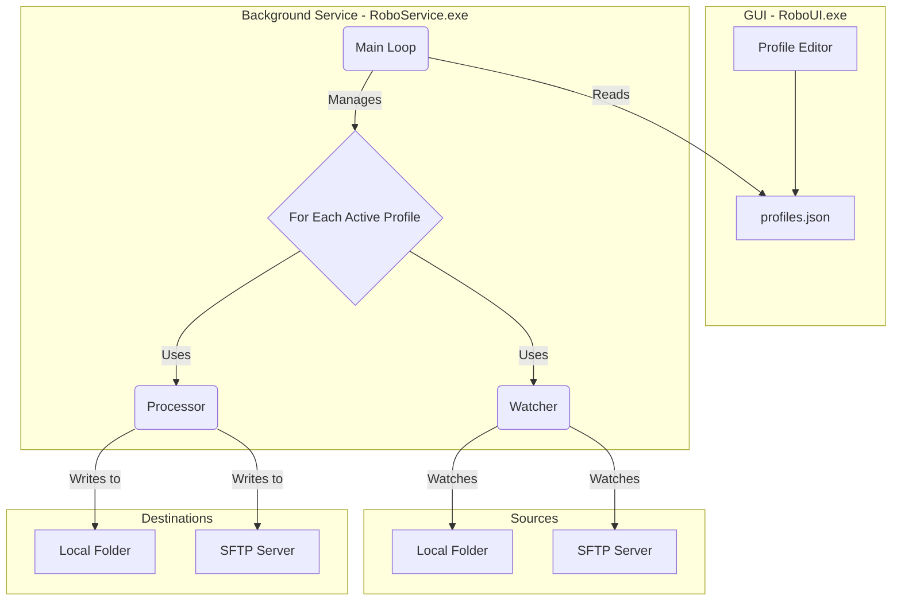

# EDI-CONTROL

A robust, profile-based automation engine for APM Terminals, designed to monitor and transfer files between various sources and destinations (including local folders and SFTP servers) based on configurable rules. This tool runs as a reliable Windows Service, ensuring continuous operation for critical data integration tasks.

## Overview

EDI Control is a reliable, profile-driven automation engine for APM Terminals Pecém Terminal. It continuously monitors sources and transfers files to destinations according to configurable rules, supporting both local and remote (SFTP) endpoints. It runs seamlessly as a Windows Service to ensure uninterrupted operation of critical workflows.

## Data Flow & Architecture

The system is designed with a decoupled two-part architecture: a background Windows Service (the "Engine") that performs all the work, and a desktop GUI (the "Control Panel") for configuration and monitoring. This ensures that the automation tasks run 24/7, regardless of whether a user is logged in.

The v2.0 architecture is based on a modular **Source -\> Destination** model.



## Key Features

  * **Source/Destination Model**: Flexibly transfer files from a source to a destination, with support for:
      * Local Folder to Local Folder
      * SFTP to Local Folder
      * Local Folder to SFTP
      * SFTP to SFTP
  * **Multi-Profile Architecture**: Create and manage an unlimited number of independent transfer profiles.
  * **Persistent Windows Service**: The core engine runs as a Windows Service (via NSSM), ensuring it starts with the server and restarts automatically on failure.
  * **Secure Credential Management**: Passwords for SFTP connections are stored securely in the Windows Credential Manager using the `keyring` library, not in plain text.
  * **GUI Control Panel**: A user-friendly desktop application (`RoboUI.exe`) for creating, editing, and managing profiles. It includes a real-time dashboard to monitor the queue and status of each profile.
  * **SFTP Browser**: An integrated file browser within the profile editor to easily navigate remote SFTP directories and select paths.
  * **Flexible Rule Engine**:
      * **File Name Filtering**: Use standard wildcard patterns (`*.txt`, `*EXAMPLE*.json`) to precisely target files.
      * **File Age Filtering**: Process files based on their modification date (e.g., only today's files, files from the last 3 months).
  * **Persistent Queuing**: Each profile uses a dedicated SQLite database to queue files, guaranteeing no data is lost during outages. The system automatically prevents processing duplicate files based on their content hash.
  * **Pre-execution Preview**: A powerful tool that simulates a profile's execution, showing exactly which files would be transferred (from local or SFTP sources) without performing any real actions.
  * **Detailed & Segregated Logging**: Every action is recorded. The main application has a general log, and each profile writes to its own dedicated, date-rotated log file.
  * **System Tray Integration**: The GUI can be minimized to the system tray for unobtrusive operation.

## Installation & Usage

The application is deployed as two separate executables: `RoboService.exe` (the engine) and `RoboUI.exe` (the GUI).

### Server-Side Setup (Windows Service)

#### Option 1: Download the Latest Release

1.  Go to the [EDI-CONTROL Releases](https://github.com/lucas-souza-maersk/EDI-CONTROL/releases) page.
2.  Download the latest package containing both `RoboService.exe` and `RoboUI.exe`.
3.  Copy the entire folder to a permanent location on the server (e.g., `C:\AutomationService\`).

-----

#### Option 2: Compile from Source using PyInstaller

1.  Clone the repository:
    ```bash
    git clone https://github.com/lucas-souza-maersk/EDI-CONTROL/
    cd EDI-CONTROL
    ```
2.  Install Python dependencies:
    ```bash
    pip install -r requirements.txt
    ```
3.  Build the executables using PyInstaller:
      * For the service (console mode):
        ```bash
        pyinstaller --onefile --name="RoboService" run_service.py
        ```
      * For the GUI (windowed mode with icon):
        ```bash
        pyinstaller --onefile --windowed --name="RoboUI" --add-data "apm.ico;." --icon="apm.ico" main.py
        ```
4.  The compiled executables will be in the `dist/` folder. Copy them to a permanent location on the server.

-----

#### Install as a Service using NSSM

1.  Download [NSSM](https://nssm.cc/download).
2.  Open Command Prompt as **Administrator**.
3.  Run `nssm install <ServiceName>` (e.g., `nssm install EDI-CONTROL`).
4.  In the NSSM GUI:
      * **Path**: Full path to `RoboService.exe`.
      * **Startup directory**: Folder containing the executable.
5.  (Recommended) Configure logging on the **I/O** tab to capture console output.
6.  Click **Install service** and start it via `nssm start <ServiceName>` or the Windows Services panel.

-----

### Client-Side Usage (Configuration)

1.  **Run the Control Panel**: Execute `RoboUI.exe`.
2.  **Create a Profile**:
      * Go to the "Profile Settings" tab.
      * Click "Create New Profile".
      * Fill in the required fields, selecting the Source and Destination types.
      * For SFTP connections, use the "Setup Connection(s)" button to enter credentials (password will be stored securely) and browse for the remote path.
      * **Check the "Active" box** to enable the profile.
      * Save the profile.
3.  **Activation**: The running Windows Service automatically detects new or changed active profiles (typically within 20 seconds) and starts executing them.
4.  **Monitoring**: Use the **Dashboard** tab to select a profile and monitor its queue, status, and statistics in real-time.

-----

### Configuration Management

  * **`profiles.json`**: The single source of truth for all profile configurations, located in the same folder as the executables. It is managed exclusively through the Control Panel.
  * **Credentials**: SFTP passwords are **not** stored in `profiles.json`. They are handled securely by the Windows Credential Manager. Because of this, the Import/Export feature has been removed in v2.0 to prevent insecure handling of credentials.